# FLUIDOS Edge Installation Guide & Use Cases

This guide provides all the necessary information needed to create a basic setup that enables Edge nodes and devices management. In the following sections, we will install and configure CloudCore, EdgeCore, an MQTT broker, and a Mapper prerequisites to enable accessing and managing Edge nodes (Meta Edge) and devices (Deep Edge and Micro Edge) as seen in section [FLUIDOS Edge Architecture](#fluidos-edge-architecture). Also, we will validate the setup by deploying pods at the Meta Edge node and by reading sensor values coming from a Micro Edge device over Bluetooth and via a Mapper (both by using kubectl Kubernetes CLI tool from the Cloud layer). Finally, we will deploy a more advanced scenario where many cloud applications will share a Leaf Edge Device (LED), which is part of Micro Edge, and selectively read data from an LED's sensors.

# FLUIDOS Edge Architecture

The following figure depicts the overall FLUIDOS Edge multi-layered architecture.

[fe-arch]: drax/figures/Fluidos-edge.png "Fluidos-Edge Architecture" 
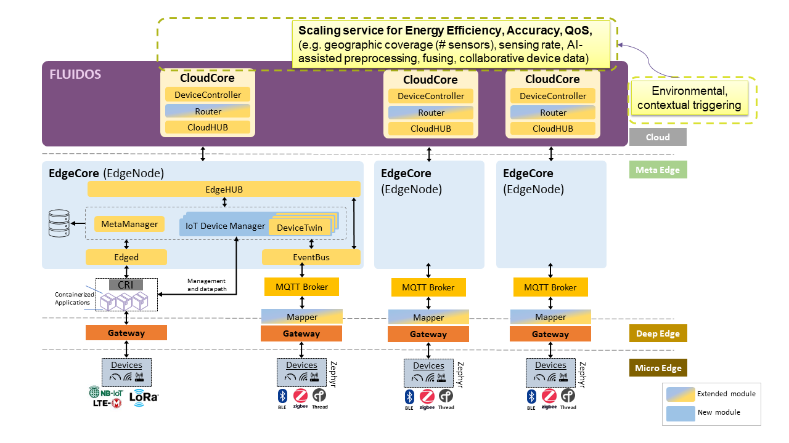

## Cloud
This is the upper layer that moves toward distant resources, with the components called Fog Computing (usually at the customer’s premises) and Multi-access Edge Computing (MEC), till to the Cloud, which brings large data centers into the picture.

## Meta Edge
Meta Edge is used to describe edge computing architectures that involve a layer of computing resources located between the edge and the cloud. The meta edge may be responsible for aggregating and processing data from multiple deep edge devices, and it may be located closer to the edge than the cloud, but further from the data source than micro edge or deep edge devices.

## Deep Edge
Deep Edge refers to the intermediate layer of the hierarchy, which is located between the micro edge and the meta edge. This layer is responsible for more advanced processing and decision-making, and it may include devices such as gateways and edge servers that are capable of handling more complex tasks than the devices at the micro edge. It includes IoT devices and processing, network computing units and intelligent controllers.

## Micro Edge
Micro Edge refers to the lowest level of the hierarchy, which includes the devices and sensors that are located at the edge of the network. These devices typically have limited processing and storage capabilities, and they rely on the other layers of the hierarchy for communication and decision-making. These services include sensing/actuating, connectivity, intelligent processing

# Cloud Layer Installation & Configuration

For installing FLUIDOS Edge (Cloud layer), the following hardware and software information must be taken into account (in any other case, the procedure will probably need to be adjusted accordingly):
-   Target platforms
    - AMD64 architecture enabled platforms
    - This guide's instructions were tested using a workstation with the following characteristics
        -   CPU Architecture: x86_64
        -   Byte Order: Little Endian
        -   CPU(s): 8
        -   CPU Model name: Intel(R) Xeon(R) CPU E3-1246 v3 @ 3.50GHz
        -   RAM: 16GB (15.1GB usable)
-   Software
    -   OS: Debian GNU/Linux 11 (bullseye)
    -   Kernel: 5.10.0-26-amd64 #1 SMP Debian 5.10.197-1 (2023-09-29) x86_64 GNU/Linux
    -   GNU C Library: (Debian GLIBC 2.31-13+deb11u7) 2.31
    -   Containerd: v1.6.24
    -   Kubernetes: v1.24.14
    -   [KubeEdge](https://kubeedge.io/): v1.14.3

## Dependencies
 
-   Kubernetes Cluster
-   Contairnerd runtime

## Useful links
-   [Kubernetes keadm installation](https://kubernetes.io/docs/setup/production-environment/tools/kubeadm/install-kubeadm/)
-   [Deploying a Kubernetes cluster](https://kubernetes.io/docs/setup/production-environment/tools/kubeadm/create-cluster-kubeadm/)
-   [KubeEdge](https://kubeedge.io/)

## Installation & Configuration

All the commands should be executed as root unless otherwise noted or is a *kubectl* command.

### Container Runtime & Kubernetes

Configure hosts file so that nodes can communicate each other using names.
``` bashore & MQTT Broker
vim /etc/hosts
```
Add the following list in the end of line
```txt
"Server IP address" kubmaster
"Worker IP address" kubworker1
```
Save and exit with :wq (if using vim)

Replace "Server IP address" and kubmaster with Cloud layer node IP and name.
Replace "Worker IP address" and kubworker1 with Meta Edge layer node IP and name.

Configure modules required by container runtime; we will use Containerd.
``` bash
modprobe overlay
modprobe br_netfilter
```
To make changes permanent.
``` bash
cat << EOF | tee /etc/modules-load.d/kubernetes.conf
overlay
br_netfilter
EOF
```
Configure networking kernel parameters to support local service-pod access using sysctl.
``` bash
cat <<EOF | tee /etc/sysctl.d/99-kubernetes.conf
net.bridge.bridge-nf-call-iptables = 1
net.bridge.bridge-nf-call-ip6tables = 1
net.ipv4.ip_forward = 1
EOF
```
Load settings from all system configuration files.
```bash
sysctl --system
```

Disable Swap [^1]
```bash
 swapoff -a
```
To make change permanent, edit */etc/fstab* file and comment the line that
enables swap partition.
[^1]: [https://discuss.kubernetes.io/t/swap-off-why-is-it-necessary/6879](https://discuss.kubernetes.io/t/swap-off-why-is-it-necessary/6879)

Install the Containerd runtime.
```bash
apt-get -y install curl apt-transport-https
mkdir /etc/apt/keyrings/
curl -fsSL https://download.docker.com/linux/ubuntu/gpg | gpg --dearmor -o /etc/apt/keyrings/docker.gpg
echo "deb [arch=$(dpkg --print-architecture) signed-by=/etc/apt/keyrings/docker.gpg] https://download.docker.com/linux/ubuntu $(lsb_release -cs) stable" | tee /etc/apt/sources.list.d/docker.list > /dev/null
apt-get update
apt-get install containerd.io
```

Configure the Containerd to use Systemd as cgroup (control group) driver
```bash
mkdir -p /etc/containerd
containerd config default | tee /etc/containerd/config.toml
```

Change SystemdCgroup property in Containerd confoguration file to true.
```bash
sed -i 's/SystemdCgroup \= false/SystemdCgroup \= true/g' 
/etc/containerd/config.toml
```
Restart and enable the Containerd service.
```bash
systemctl restart containerd
systemctl enable containerd
```

Verify Containerd configuration.
```bash
containerd config dump
```

Install Kubernetes.
```bash
curl -fsSLo /etc/apt/keyrings/kubernetes-archive-keyring.gpg https://packages.cloud.google.com/apt/doc/apt-key.gpg 
echo "deb [signed-by=/etc/apt/keyrings/kubernetes-archive-keyring.gpg] https://apt.kubernetes.io/ kubernetes-xenial main" | tee /etc/apt/sources.list.d/kubernetes.list
apt-get update
apt-get install -y kubelet=1.24.14-00 kubeadm=1.24.14-00 kubectl=1.24.14-00
apt-mark hold kubelet kubeadm kubectl
systemctl enable kubelet
```

Fetch the required images before cluster initialization
```bash
kubeadm config images pull --cri-socket unix:///run/containerd/containerd.sock --kubernetes-version 1.24.14
```

Initialize Kubernetes cluster using Flannel as CNI (Container Network Interface)
```bash
kubeadm init --pod-network-cidr=10.244.0.0/16 --cri-socket unix:///run/containerd/containerd.sock --kubernetes-version 1.24.14
```

Enable normal user ability to contact Kubernetes API server, by executing the following commands.
```bash
USER_ID=$(id -u <USER_NAME>)
USER_HOME=/home/<USER_HOME_DIR_NAME>
mkdir -p $USER_HOME/.kube
cp -i /etc/kubernetes/admin.conf $USER_HOME/.kube/config
chown $USER_ID:$USER_ID $USER_HOME/.kube/config
```
Replace _<USER_HOME_DIR_NAME>_ with the actual user home directory name and _<USER_NAME>_ with user's name.

Avoid kube-proxy being deployed on Edge Node, as this guide does not include enabling native networking between master and worker nodes, but only via Cloud and Edge HUB. Apply the following commands as normal user.
```bash
kubectl patch daemonset kube-proxy -n kube-system -p '{"spec": {"template": {"spec": {"affinity": {"nodeAffinity": {"requiredDuringSchedulingIgnoredDuringExecution": {"nodeSelectorTerms": [{"matchExpressions": [{"key": "node-role.kubernetes.io/edge", "operator": "DoesNotExist"}]}]}}}}}}}'
```
Do the same for CoreDNS.
```bash
kubectl patch deploy coredns -n kube-system -p '{"spec": {"template": {"spec": {"affinity": {"nodeAffinity": {"requiredDuringSchedulingIgnoredDuringExecution": {"nodeSelectorTerms": [{"matchExpressions": [{"key": "node-role.kubernetes.io/edge", "operator": "DoesNotExist"}]}]}}}}}}}'
```

Install the latest Container Networking Interface (CNI) plugins.
```bash
VER=$(curl -s https://api.github.com/repos/containernetworking/plugins/releases | grep tag_name | cut -d '"' -f 4 | sed 1q | sed 's/v//g')
wget https://github.com/containernetworking/plugins/releases/download/v$VER/cni-plugins-linux-amd64-v$VER.tgz
mkdir -p /opt/cni/bin\
tar Cxzvf /opt/cni/bin cni-plugins-linux-amd64-v$VER.tgz
```

Configure firewall rules for kubernetes (if firewall is active) to allow traffic over the following ports and reload the rules (if firewall is other than _ufw_ adapt the commands accordingly)
```bash
ufw allow 6443/tcp
ufw allow 2379/tcp
ufw allow 2380/tcp
ufw allow 10250/tcp
ufw allow 10251/tcp
ufw allow 10252/tcp
ufw allow 10255/tcp
ufw reload
```

Remove the taints on the master so that pods can be scheduled on it (as normal user).
```bash
kubectl taint nodes --all node-role.kubernetes.io/control-plane-
```
It should return the following: node \<hostname\> untainted

Install Flannel CNI (as normal user).
```bash
kubectl apply -f https://github.com/flannel-io/flannel/releases/latest/download/kube-flannel.yml
```

Confirm that all the pods are running with the following command.
```bash
watch kubectl get pods -n kube-flannel
```

Avoid kube-flannel being deployed on edgenode (as normal user).
```bash
kubectl patch daemonset kube-flannel-ds -n kube-flannel -p '{"spec": {"template": {"spec": {"affinity": {"nodeAffinity": {"requiredDuringSchedulingIgnoredDuringExecution": {"nodeSelectorTerms": [{"matchExpressions": [{"key": "node-role.kubernetes.io/edge", "operator": "DoesNotExist"}]}]}}}}}}}'
```

Confirm that you now have a node in your cluster with the following
command (as normal user).
```bash
kubectl get nodes -o wide
```

Verify system pods status (as normal user).
```bash
kubectl get pods -n kube-system
```

Verify node status and cluster info (as normal user).
```bash
kubectl cluster-info
```

### CloudCore

Install an administration CLI tool, i.e., keadm, which will help to install and configure CloudCore.
```bash
KE_VER=1.14.3
wget https://github.com/kubeedge/kubeedge/releases/download/v$KE_VER/keadm-v$KE_VER-linux-amd64.tar.gz
tar -xvf keadm-v$KE_VER-linux-amd64.tar.gz
mv keadm-v$KE_VER-linux-amd64/keadm/keadm /usr/local/bin/
chown root.root /usr/local/bin/keadm
```

If a firewall is present, make sure that traffic on ports 10000,
10002, 10003 and 10004 is enabled.

The default configuration file path is
```text
/etc/kubeedge/config/cloudcore.yaml
```
you can also manually specify it by specifying the flag option '--config'.

Create configuration folder (default location).
```bash
mkdir -p /etc/kubeedge/config/
```

Either create a minimal configuration
```bash
~/cmd/cloudcore --minconfig | tee /etc/kubeedge/config/cloudcore.yaml
```
or a full configuration.
```bash
~/cmd/cloudcore --defaultconfig | tee /etc/kubeedge/config/cloudcore.yaml
```

Edit ```cloudcore.yaml``` file and modify setting.
```kubeAPIConfig.kubeConfig``` or ```kubeAPIConfig.master```, to point to 
the path of your kubeconfig file. Some common places are 
```/root/.kube/config``` or ```/home/$USER/.kube/config```.

Edit cloudcore.yaml and enable the router module.
```bash
ROUTER_ENA_LINE=$(awk '/router/{print NR}' /etc/kubeedge/config/cloudcore.yaml)
PATCH_LINE=$(awk -v reline="$ROUTER_ENA_LINE" 'NR >= reline && /enable/{ print NR; exit }' /etc/kubeedge/config/cloudcore.yaml)
awk  -v paline="$PATCH_LINE" '{if (FNR==paline) $0="    enable: true";print}' /etc/kubeedge/config/cloudcore.yaml | sudo tee /etc/kubeedge/config/cloudcore.yaml > /dev/null
```

If you wish to modify and/or create your own image and upload it to your repository, you may refer to the [FluidosEdge-System](https://github.com/otto-tom/FluidosEdge-System) and follow the instructions.

Initialize KubeEdge cloud core (as normal user).
```bash
keadm init --advertise-address=<SERVER-IP> --profile version=v1.14.3-test-router --kube-config=<KUBECONFIG_PATH> --kubeedge-version=v1.14.3-test-router --set cloudCore.modules.router.enable=true --set cloudCore.image.repository=othontom/cloudcore --set cloudCore.image.pullPolicy=Always
```

Where *<SERVER_IP>* can be either servers IP or name as defined at Step 1, and *<KUBECONFIG_PATH>* is the kubeconfig file path.

Verify KubeEgde is running (as normal user)
```bash
kubectl get all -n kubeedge
```

Sample output
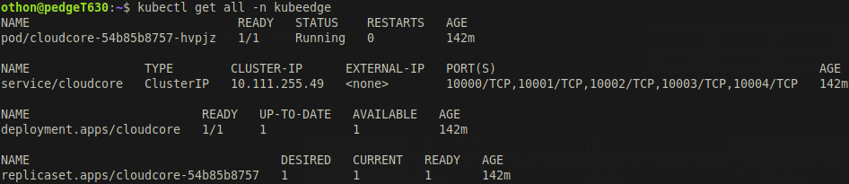

Generate and keep the registration token (as normal user). This token will be used by the
Edge node (running edge core) to join the Cloud (master) node (running cloud core).
[]()
```bash
keadm gettoken --kube-config=/home/$USER/.kube/config
```

## Progress So Far

The following figure shows an overview of the current setup progress (Cloud Layer Installation & Configuration).
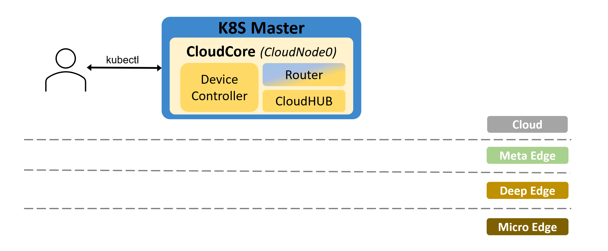

# Meta Edge Layer Installation & Configuration

For installing FLUIDOS Edge (Meta Edge layer), the following hardware and software information must be taken into account (in any other case, the procedure will probably need to be adjusted accordingly):

-   Target platforms
    - Barebone boards, e.g., [Intel NUC](https://www.intel.com/content/www/us/en/products/details/nuc.html) (amd64)
    - Embedded MPU boards, e.g., [STM32MP2 MPU series](https://www.st.com/content/st_com/en/campaigns/microprocessor-stm32mp2.html) (arm64)
-   Software
    -   OS: Debian GNU/Linux 11 (bullseye)
    -   Kernel: 5.10.0-26-amd64 #1 SMP Debian 5.10.197-1 (2023-09-29) x86_64 GNU/Linux
    -   GNU C Library: (Debian GLIBC 2.31-13+deb11u7) 2.31
    -   KubeEdge: v1.14.3
    -   Docker Engine: v24.0.6

## Dependencies

-   Container runtimes (one of the following)
    -   Docker (we'll use this runtime)
    -   Containerd (default option for versions >= 1.13.0; faced fs
        corruption after deployment)
    -   Cri-o (For KubeEdge <= 1.13.0 there is a bug fixed in future
        releases, which is not released yet (as of 2023-02-12)
        (https://github.com/kubeedge/kubeedge/pull/4520/commits))
    -   Virtlet (not tested)
-   GO (Only if CRI-O is selected as runtime)

## Useful links

-   [Docker installation](https://docs.docker.com/desktop/install/linux-install/)
-   [KubeEdge](https://kubeedge.io/)

## Installation & Configuration
All the commands should be executed as root unless otherwise noted or is a *kubectl* command.

### EdgeCore & MQTT Broker

Setup host files so that the node can communicate each other using  names. Edit the hosts file accordingly.
```bash
vim /etc/hosts
```

Add the following lines at the end of the file 
```text
"Server IP address" kubmaster
"Worker IP address" kubworker1
```
save and exit with :wq

Replace _"Server IP address"_ and kubmaster with Cloud layer (master) node's IP and name.
Replace _"Server IP address"_ and kubworker1 with Meta Edge layer node's IP and name.

Configure modules required by container runtime; we will use
Containerd.
```bash
modprobe overlay
modprobe br_netfilter
```

To make changes permanent.
```bash
cat << EOF | tee /etc/modules-load.d/containerd.conf
overlay
br_netfilter
EOF
```

Configure networking kernel parameters to support local service-pod access using sysctl.
```bash
cat << EOF | tee /etc/sysctl.d/99-containerd.conf
net.bridge.bridge-nf-call-iptables = 1
net.bridge.bridge-nf-call-ip6tables = 1
net.ipv4.ip_forward = 1
EOF
```

Load settings from all system configuration files.
```bash
sysctl --system
```

Configure firewall rules for kubernetes (if firewall is active) to allow traffic over the following ports and reload the rules (if firewall is other than _ufw_ adapt the commands accordingly)
```bash
ufw allow 10250/tcp
ufw allow 10251/tcp
ufw allow 10255/tcp
ufw allow 30000-32767/tcp
ufw reload
```

Install Docker Engine (replace _\<USER\>_ with normal user's name).
```bash
USER_NAME=<USER>
apt-get update
apt-get install ca-certificates curl gnupg lsb-release
mkdir -m 0755 -p /etc/apt/keyrings/
curl -fsSL https://download.docker.com/linux/debian/gpg | gpg --dearmor -o /etc/apt/keyrings/docker.gpg
echo "deb [arch=$(dpkg --print-architecture) signed-by=/etc/apt/keyrings/docker.gpg] https://download.docker.com/linux/debian $(lsb_release -cs) stable" | tee /etc/apt/sources.list.d/docker.list > /dev/null
apt-get update
apt-get install docker-ce docker-ce-cli containerd.io docker-buildx-plugin docker-compose-plugin
usermod -aG docker $USER_NAME
mkdir -p /etc/systemd/system/docker.service.d
tee /etc/docker/daemon.json << EOF
{
"exec-opts": ["native.cgroupdriver=systemd"],
"log-driver": "json-file",
"log-opts": {
"max-size": "100m"
},
"storage-driver": "overlay2"
}
EOF
```

Proper comunication with the Docker Engine requires a shim interface. We will install Mirantis cri-dockerd. Mirantis cri-dockerd CRI UNIX socket file is located at ```/run/cri-dockerd.sock```.
```bash
VER=$(curl -s https://api.github.com/repos/Mirantis/cri-dockerd/releases/latest | grep tag_name | cut -d '"' -f 4 | sed 's/v//g') 
wget https://github.com/Mirantis/cri-dockerd/releases/download/v${VER}/cri-dockerd-${VER}.amd64.tgz
tar xvf cri-dockerd-${VER}.amd64.tgz
mv cri-dockerd/cri-dockerd /usr/local/bin/
cri-dockerd --version
wget https://raw.githubusercontent.com/Mirantis/cri-dockerd/master/packaging/systemd/cri-docker.service
wget https://raw.githubusercontent.com/Mirantis/cri-dockerd/master/packaging/systemd/cri-docker.socket
mv cri-docker.socket cri-docker.service /etc/systemd/system/
sed -i -e 's,/usr/bin/cri-dockerd,/usr/local/bin/cri-dockerd,' /etc/systemd/system/cri-docker.service
sed -i '/ExecStart/ s/$/ --network-plugin=/' /etc/systemd/system/cri-docker.service
systemctl daemon-reload
systemctl enable cri-docker.service
systemctl enable --now cri-docker.socket
systemctl start cri-docker.service
```

Install the latest CNI plugins.

```bash
VER=$(curl -s https://api.github.com/repos/containernetworking/plugins/releases | grep tag_name | cut -d '"' -f 4 | sed 1q | sed 's/v//g')
wget https://github.com/containernetworking/plugins/releases/download/v$VER/cni-plugins-linux-amd64-v$VER.tgz
mkdir -p /opt/cni/bin
tar Cxzvf /opt/cni/bin cni-plugins-linux-amd64-v$VER.tgz
```

Configure containerd to use systemd as cgroup driver.
```bash
mkdir -p /etc/containerd
containerd config default | tee /etc/containerd/config.toml
```

Change SystemdCgroup property and make equal to true.
```bash
sed -i 's/SystemdCgroup \= false/SystemdCgroup \= true/g' /etc/containerd/config.toml
```

Restart Containerd and Docker.
```bash
systemctl daemon-reload
systemctl restart docker
systemctl enable docker
systemctl restart containerd
```

Download and install _keadm_ CLI tool that will automate EdgeCore and MQTT broker installation and configuration.
```bash
KE_VER=1.14.3
wget https://github.com/kubeedge/kubeedge/releases/download/v$KE_VER/keadm-v$KE_VER-linux-amd64.tar.gz
tar -xvf keadm-v$KE_VER-linux-amd64.tar.gz
mv keadm-v$KE_VER-linux-amd64/keadm/keadm /usr/local/bin/
chown root.root /usr/local/bin/keadm
```

Based on the configuration parameters, the Meta Edge node (via EdgeCore) will join the Cloud node (replace _<SERVER_IP>_ with the cloud side node's IP or name that have set at the hosts file) (replace _<TOKEN>_ with the token that was generated during the last step of the Cloud layer section[asdad](#cloud-layer-installation--configuration)).
```bash
MASTER_NODE_IP=<SERVER_IP>
KE_TOKEN=<TOKEN>
keadm join --cloudcore-ipport=$MASTER_NODE_IP:10000 --token=$KE_TOKEN --kubeedge-version=v1.14.3 --cgroupdriver systemd --remote-runtime-endpoint unix:///var/run/cri-dockerd.sock --runtimetype remote
```

If the procedure completes successfully, the last message you should see printed is 
```"KubeEdge edgecore is running, For logs visit: journalctl -u edgecore.service -xe"```

Verify that the Meta Edge node is visible by the Cloud node. Invoke the following command (from the Cloud layer).
```bash
kubectl get nodes -l node-role.kubernetes.io/edge=
```

The expected output should be similar to the following.
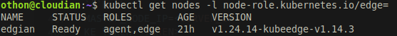

### Mapper
#### Bluetooth

From the Cloud layer (using kubectl CLI) we will install the Bluetooth Mapper. There is a pre-built image of the Bluetooth Mapper available, but also a modified version can be used, after compiling the source code (**!!!REFERENCE HERE**)

**!!!Link to the real example and source yamls**

First, label the Meta Edge layer node do easily schedule workloads to this specific node, using Kunernetes nodeSelector.
```bash
ME_NODE_NAME=<YOUR_NODE_NAME>
kubectl label nodes $ME_NODE_NAME ble=true
```
The expected output is, ```node/<YOUR_NODE_NAME> labeled```

Next we need to declare at least one device model and one device instance for this specific model. Here follows a device model yaml file sample (*BLE-Device-Model.yaml*),
```yaml
apiVersion: devices.kubeedge.io/v1alpha2
kind: DeviceModel
metadata:
 name: bluenrg
 namespace: default
spec:
 properties:
  - name: environmental
    description: temperature and atmospheric pressure
    type:
     int:
      accessMode: ReadOnly
```
and a device instance sample (*BLE-Instance.yaml*).
```yaml
apiVersion: devices.kubeedge.io/v1alpha2
kind: Device
metadata:
  name: bluenrg-instance-01
  labels:
    description: Sensor-Tile-Board
    manufacturer: STMicroelectronics
    model: STWINKT1B
spec:
  deviceModelRef:
    name: bluenrg
  protocol:
    bluetooth:
      macAddress: "AA:BB:CC:DD:EE:FF" #MAC address of the IoT device to pair with
  nodeSelector:
    nodeSelectorTerms:
    - matchExpressions:
      - key: ''
        operator: In
        values:
        - edgian          #Meta Edge node name that pairs the IoT device 
  propertyVisitors:
    - propertyName: environmental
      collectCycle: 500000000
      reportCycle: 1000000000    
      bluetooth:
        characteristicUUID: A7E57001400 #Should match the UUID that the IoT device uses 
        dataConverter:
         startIndex: 2
         endIndex: 7
         orderOfOperations:             
  data:
    dataTopic: "$ke/events/device/+/data/update"
    dataProperties:
      - propertyName: environmental
        metadata:
          type: integer                
status:
  twins:
    - propertyName: environmental

```
For more information about the available properties you can refer to the Mapper's repository (**REFERENCE HERE**).
Create the device model and instance using the yaml files.
```bash
kubectl apply -f BLE-Device-Model.yaml
kubectl apply -f BLE-Instance.yaml
```
This is the right sequence to create a device, any device instance must precede the model creation. Deletion should be done in reverse order, delete any instance first and then the model.

Next step is to deploy the Bluetooth Mapper. This is a sample yaml file of the deployment.

```yaml
apiVersion: apps/v1
kind: Deployment
metadata:
  name: ble-mapper
spec:
  replicas: 1
  selector:
    matchLabels:
      app:  ble-mapper
  template:
    metadata:
      labels:
        app:  ble-mapper
    spec:
      hostNetwork: true
      containers:
        - name: ble-mapper-container
          image:  dbakoyiannis/ble-mapper:v1.0-linux-amd64 # BLE mapper image
          imagePullPolicy: IfNotPresent
          securityContext:
            privileged: true
          volumeMounts:
            - name: config-volume
              mountPath: /opt/kubeedge/
      nodeSelector:
        ble: "true"
      volumes:
        - name: config-volume
          configMap:
            name: device-profile-config-<MetaEdgeNodeName>  # replace <MetaEdgeNodeName> with the actual Meta Edge node name, e.g. edgian
            items:
            - key: deviceProfile.json
              path: deviceProfile.json
      restartPolicy: Always
EOF
```

Deploy the with the following command.

```bash
kubectl apply -f BTmapper-Deployment.yaml
```

### Containerized Applications

From the Cloud layer (using kubectl CLI) we will deploy a pod at the Meta Edge Layer.
With the following command we are going to deploy an NGINX server to the Meta Edge node.
```bash
cat <<EOF | kubectl apply -f - 
apiVersion: apps/v1
kind: Deployment
  metadata:
    name: nginx-deployment
    labels:
      name: nginx-edge
  spec:
    selector:
      matchLabels:
        app: nginx-edge
    replicas: 1
    template:
      metadata:
        labels:
        app: nginx-edge
    spec:
      containers:
      - name: nginx-edge
        image: nginx:1.14.2
        ports:
        - containerPort: 80
      nodeSelector:
        "node-role.kubernetes.io/edge": "edgian"  # Replace with the desired node name
EOF
```

You should see the following message.
```text
"pod/nginx created"
```

Verify that the Pod is deployed to worker edge node with the following command:
```bash
kubectl get pod -owide
```
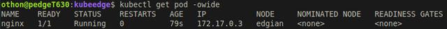

## Progress So Far

The following figure shows an overview of the current setup progress (Cloud and Meta Edge Layers Installation & Configuration).
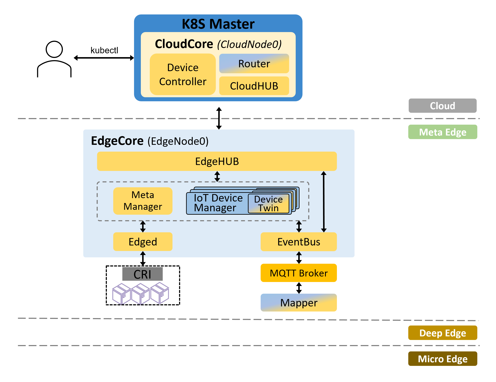

# Deep Edge Layer Side Installation & Configuration

Currently, we do utilize the Deep Edge layer. This layer could host devices such as gateways, which have properties such as, communication protocol conversion, aggregation, etc.

# Micro Edge Layer Side Installation & Configuration

## Useful links

-    [STM32 STWIN SensorTile Wireless Industrial Node](https://www.st.com/en/evaluation-tools/steval-stwinkt1b.html)
-    [STM32CubeIDE](https://www.st.com/en/development-tools/stm32cubeide.html)
-    [STM32CubeIDE User Manual](https://www.st.com/resource/en/user_manual/um2609-stm32cubeide-user-guide-stmicroelectronics.pdf)
-    [STM32 Cube Programmer](https://www.st.com/en/development-tools/stm32cubeprog.html)
-    [STM32 BLE library]()
-    [STM32 MEMS library]()
-    [STM32 Application notes about using CubeIDE, programmer, etc...]()

## Leaf Edge Device
At the following subsections we are going to describe a procedure for compiling and flashing the firmware for a BLE LED. We will use [STM32CubeIDE](https://www.st.com/en/development-tools/stm32cubeide.html) to complete the aforementioned procedures. If you want to use the pre-compiled firmware it is available under *[fw/](../../fw/)* folder, and you can move directly at the [Flush the Firmware](#flush-the-firmware) subsection.

### Bluetooth LED
First thing to do is to create a basic project for your STM32 board ([STM32CubeIDE User Manual](https://www.st.com/resource/en/user_manual/)). At the subsections that follow we suppose that the selected board is [STM32 STWIN SensorTile Wireless Industrial Node](https://www.st.com/en/evaluation-tools/steval-stwinkt1b.html) and the sensor to sample is [LPS22HH](https://www.st.com/en/mems-and-sensors/lps22hh.html), which can provide the environmental temperature and pressure.

#### Enable Sensor Sampling
After creating a basic project for your STM32 board ([STM32CubeIDE User Manual](https://www.st.com/resource/en/user_manual/)), launch CubeMX (by double-clicking the .ioc file). Make sure that at least one I2C controller is enabled in I2C mode, as seen at the following figure, where I2C3 controller is enabled in I2C mode (leave the default configuration).
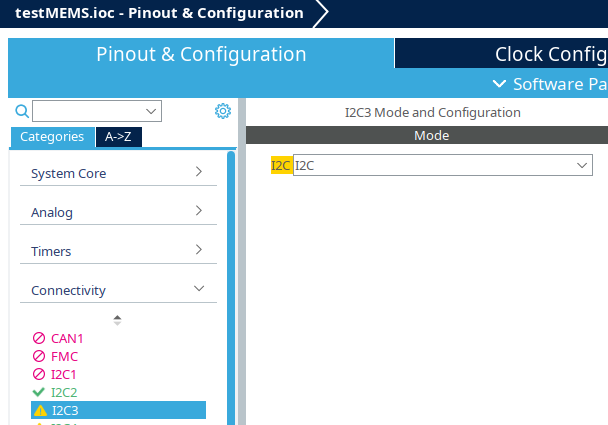

Navigate to *"Software Packs -> Select Components"* or hit *"Alt-o"* and select:
- STMicroelecroniccs.X-CUBE-MEMS1
    - Board Part Press Temp
        - LPS22HH: I2C
    - Board Support custom
        - ENV_SENSOR
Back to the main screen, navigate to *"Middleware and Software Packs"* (left vertical menu) and select *"X-CUBE-MEMS1"*. At the *"Mode"* tab select *"Board Part PresTemp"* and *"Board Support Custom"*. At the *"Configuration -> Parameter Settings"* select *"LPS22HH SA0 pin -> VDD"*. At the *"Configuration -> Platform Settings"* select *"I2C3"* as *"LPS22HH BUS IO driver"*.

Parameter Settings             |  Platform Settings
:-----------------------------:|:-----------------------------:
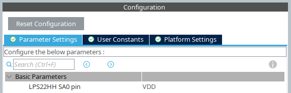  |  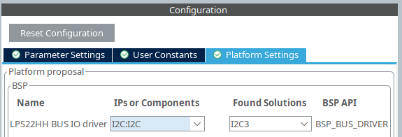

Save the file and select to generate the code when prompted. Alternatively you can explicitly select to generate code via the gear icon.

Now, it is possible to configure and read values from the enabled sensor. This is some sample C code for reading sensor values in polling mode.
```C
#include "custom_env_sensors.h"

float rd_val;

/* Initialize LPS22HH sensor */  
CUSTOM_ENV_SENSOR_Init(CUSTOM_LPS22HH_0, ENV_TEMPERATURE|ENV_PRESSURE);

/* Read Temperature */
CUSTOM_ENV_SENSOR_GetValue(CUSTOM_LPS22HH_0, ENV_TEMPERATURE, &rd_val);
  
/* Read Pressure */
CUSTOM_ENV_SENSOR_GetValue(CUSTOM_LPS22HH_0, ENV_TEMPERATURE, &rd_val);
``` 

#### Enable Bluetooth Library
#### The Main Function
#### Compile the Firmware
To compile the firmware, follow these steps:
- Select the project root directory at the *"Project Explorer"*
- From the window menu select *"Project -> Build"*

#### Flush the Firmware
There are two options to flush the firmware to the selected board. If you have built the firmware from source using [STM32CubeIDE](https://www.st.com/en/development-tools/stm32cubeide.html) you can:
- Select the project root directory at the *"Project Explorer"*
- From the window menu select *"Project -> Run -> Run As-> STM32 C/C++ Application"*

Alternatively or in the case that you use the pre-compiled firmware, [STM32 Cube Programmer](https://www.st.com/en/development-tools/stm32cubeprog.html) can be used to complete the action. Information about using the [STM32 Cube Programmer](https://www.st.com/en/development-tools/stm32cubeprog.html) can be found at [AN5054 Secure programming using STM32CubeProgrammer](https://www.st.com/resource/en/application_note/an5054-secure-programming-using-stm32cubeprogrammer-stmicroelectronics.pdf) application note.

### Progress So Far

The following figure shows an overview of the current setup progress (Cloud, Meta Edge and Micro Edge Layers Installation & Configuration).
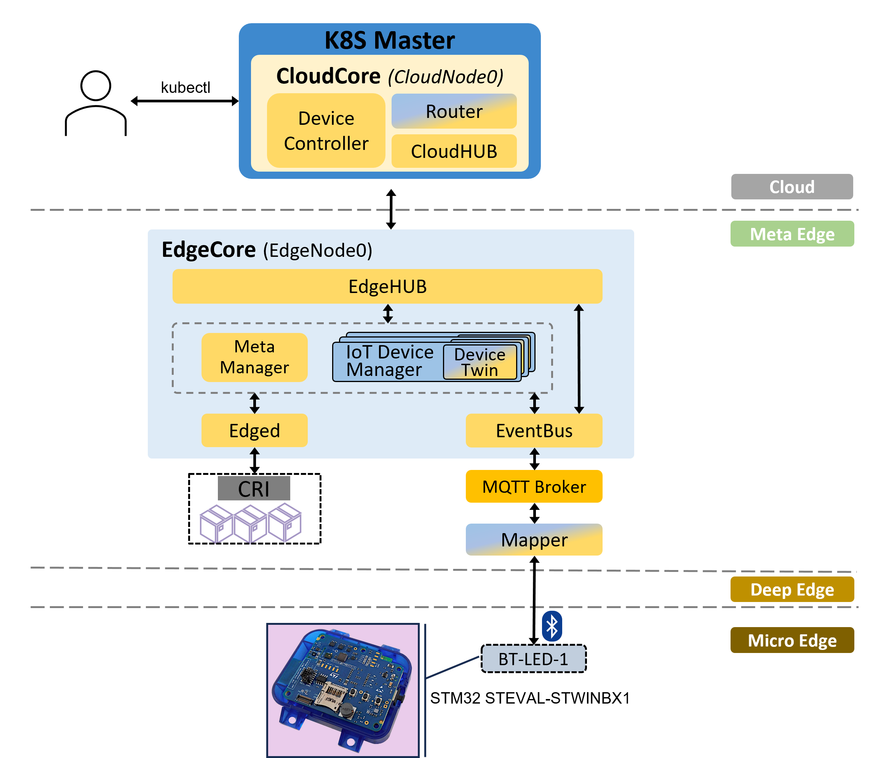

# Use Cases

## Use Case: FLUIDOS Edge resource sharing

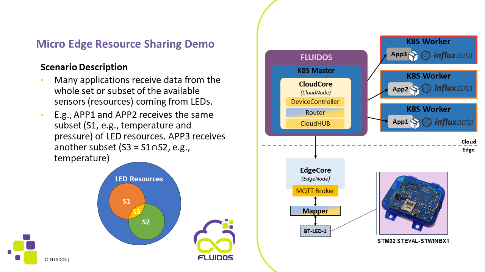

---

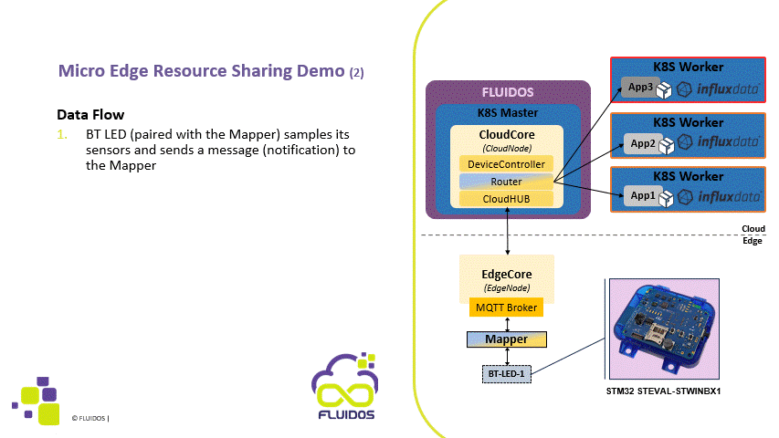
