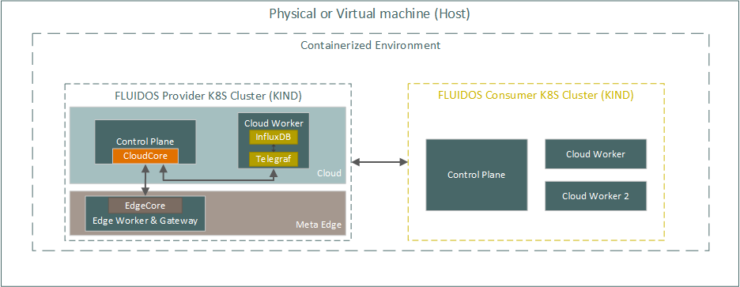
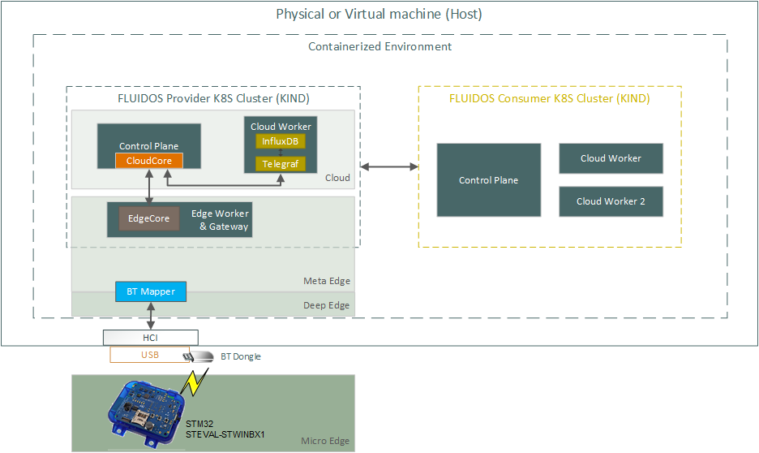

#

<p align="center">
<a href="https://www.fluidos.eu/">  </a>
<h3 align="center">FLUIDOS Node - Testbed (KIND)</h3>
</p>

## Getting Started

This guide will help you to install a FLUIDOS Node **Testbed** using KIND (Kubernetes in Docker). This is the easiest way to install the FLUIDOS Node on a local machine.

## What will be installed

This guide will create two different Kubernetes clusters:

- **fluidos-consumer**: This cluster (a.k.a., FLUIDOS node) will act as a consumer of FLUIDOS resources. It will be used to deploy a `solver` example CR that will simulate an _Intent resolution_ request. This cluster will use the REAR protocol to communicate with the Provider cluster and to receive available Flavors, reserving the one that best fits the request and purchasing it.

- **fluidos-provider**: This cluster (a.k.a. FLUIDOS node) will act as a provider of FLUIDOS resources. It will offer its own Flavors on the specific request made by the consumer, reserving and selling it.

The setup script will automatically create an edge worker node within the fluidos-provider cluster. This configuration allows you to leverage Leaf Edge Devices (LEDs), which typically lack access to the Internet and similar computer networks.
<p align="center">

</p>

### Prerequisites

- [Docker](https://docs.docker.com/get-docker/)
- [Kubectl](https://kubernetes.io/docs/tasks/tools/install-kubectl/)
- [KIND](https://kind.sigs.k8s.io/docs/user/quick-start/#installation)
- [Helm](https://helm.sh/docs/intro/install/)
- [Liqo CLI tool](https://docs.liqo.io/en/v0.10.1/installation/liqoctl.html)
- [KEINK](./bin/), this is a modified version of the official [KEINK](https://github.com/kubeedge/keink) modified to support [FluidosEdge-System](https://github.com/otto-tom/FluidosEdge-System) and also enable the Router module

## Common issues with KIND

This setup relies on KIND (Kubernetes in Docker) to quickly establish a reliable testbed for testing the FLUIDOS Node architecture.

There are common issues encountered when running multiple clusters with KIND, particularly related to swap space memory usage and resource limits within the operating systems.

Therefore, we highly recommend running the following commands before proceeding with the installation process:

1. `sudo swapoff -a`
2. `sudo sysctl fs.inotify.max_user_instances=512`
3. `sudo sysctl fs.inotify.max_user_watches=524288`

## Installation

1. Clone the repository

```sh
git clone https://github.com/fluidos-project/fluidos-edge.git
```

2. Move into the KIND Example folder

```sh
cd testbed/kind
```

3. Set the execution permission on the `setup.sh` script

```sh
chmod +x setup.sh
```

4. Launch the `setup.sh` script
> **Note**
> Please review the **architecture** field at [```solver.yaml```](deployments/node/samples/solver.yaml) and change it to **amd64** or **arm64** according to your local machine architecture.

```sh
 ./setup.sh
```

5. Wait for the script to finish. It will take some minutes.

6. After running the script, you can check the status of the pods in the consumer cluster using the following commands:

```sh
export KUBECONFIG=consumer/config
kubectl get pods -n fluidos
```

To inspect resources within the provider cluster, use the kube configuration file of the provider cluster:

```sh
export KUBECONFIG=provider/config
kubectl get pods -n fluidos
```

Alternatively, to avoid continuously changing the **KUBECONFIG** environment variable, you can run `kubectl` by explicitly referencing the kube config file:

```sh
kubectl get pods --kubeconfig "$PWD/consumer/config" --context kind-fluidos-consumer -n fluidos
```

This allows for convenient monitoring of both consumer and provider clusters without the need for manual configuration changes.

6. You should see 3 pods running on the `fluidos-consumer` cluster and 3 pods running on the `fluidos-provider` cluster:

- `node-local-resource-manager-<random>`
- `node-rear-manager-<random>`
- `node-rear-controller-<random>`

7. You can also check the status of the generated flavors with the following command:

```sh
kubectl get flavors.nodecore.fluidos.eu -n fluidos
```

The result should be something like this:

```
NAME                                   PROVIDER ID   TYPE          CPU           MEMORY       OWNER NAME   OWNER DOMAIN   AVAILABLE   AGE
<domain>-k8s-fluidos-<random-suffix>   kc1pttf3vl    k8s-fluidos   4963020133n   26001300Ki   kc1pttf3vl   fluidos.eu     true        168m
<domain>-k8s-fluidos-<random-suffix>   kc1pttf3vl    k8s-fluidos   4954786678n   25966964Ki   kc1pttf3vl   fluidos.eu     true        168m
```

8. Optionally, if edge worker node support was enabled, check if the node has successfully joined the fluidos-provider cluster: 
   ```sh
   kubectl get nodes --kubeconfig "$PWD/provider/config" --context kind-fluidos-provider
   ```
   The result should be something like this:
   ```
   NAME                             STATUS   ROLES           AGE     VERSION
   fluidos-provider-control-plane   Ready    control-plane   6m34s   v1.26.15
   fluidos-provider-worker          Ready    <none>          6m12s   v1.26.15
   fluidos-provider-worker2         Ready    agent,edge      5m36s   v1.24.17-kubeedge-v1.14.5-fluidos.2+eb9e7c3ef6b110
   ```

### Usage
In this section, we will instruct you on how you can interact with the FLUIDOS Node using a high-level approach. Furthermore, we will register a BLE LED device and properly configure FluidosEdge Router.

Now lets try to deploy a `solver` example CR on the `fluidos-consumer` cluster.

1. Set the `KUBECONFIG` environment variable to the `fluidos-consumer` cluster

```sh
export KUBECONFIG="$PWD/consumer/config"
```

3. Deploy the `solver` CR

```sh
kubectl apply -f "$PWD/deployments/node/samples/solver.yaml"
```

> **Note**
> Please review the **architecture** field and change it to **amd64** or **arm64** according to your local machine architecture.

4. Check the result of the deployment

```sh
kubectl get solver -n fluidos
```

The result should be something like this:

```
NAMESPACE   NAME            INTENT ID       FIND CANDIDATE   RESERVE AND BUY   PEERING   CANDIDATE PHASE   RESERVING PHASE   PEERING PHASE   STATUS   MESSAGE                           AGE
fluidos     solver-sample   intent-sample   true             true              false     Solved            Solved                            Solved   No need to enstablish a peering   5s
```

5. Other resources have been created, you can check them with the following commands:

```sh
kubectl get flavors.nodecore.fluidos.eu -n fluidos
kubectl get discoveries.advertisement.fluidos.eu -n fluidos
kubectl get reservations.reservation.fluidos.eu -n fluidos
kubectl get contracts.reservation.fluidos.eu -n fluidos
kubectl get peeringcandidates.advertisement.fluidos.eu -n fluidos
kubectl get transactions.reservation.fluidos.eu -n fluidos
```

6. The infrastructure for the resource sharing has been created.

You can now create a demo namespace on the `fluidos-consumer` cluster:

```sh
kubectl create namespace demo
```

And then offload the namespace to the `fluidos-provider` cluster:

```sh
liqoctl offload namespace demo --pod-offloading-strategy Remote
```

#### Deploy InfluxDB and Telegraf (remote offload)   
Create a workload inside this offloaded namespace through and already provided Kubernetes deployment:

```sh
export KUBECONFIG="$PWD/consumer/config"
kubectl apply -f ./deployments/node/samples/influxdb-deployment.yaml -n demo
kubectl wait --for=condition=ready pod -l app=influxdb -n demo --timeout=300s

export KUBECONFIG="$PWD/provider/config"
NS=$(kubectl get pod -A | grep influxdb | awk 'NR==1 {print $1}')
POD=$(kubectl get pod -A | grep influxdb | awk 'NR==1 {print $2}')
IDB_IP=$(kubectl describe pod $POD -n$NS | grep IP | head -n1 | awk 'NR==1 {print $2}')
sed -i 's, INFLUXDB_URL: .*, INFLUXDB_URL: http://'"$IDB_IP"':8086,' deployments/node/samples/telegraf-secrets.yaml

export KUBECONFIG="$PWD/consumer/config"
kubectl apply -f ./deployments/node/samples/telegraf-secrets.yaml -n demo
kubectl apply -f ./deployments/node/samples/telegraf-config.yaml -n demo
kubectl apply -f ./deployments/node/samples/telegraf-deployment.yaml -n demo
```

Now, an Influx time-series database and a Telegraf agent are deployed at the provider's cluster worker node (as seen below), which will be used to store data coming from the LED device. 

<p align="center">

</p>

#### Prepare BLE LED support
Initially, we need to setup some prerequisites at the host to enable accessing the bluetooth module (embedded or external dongle). Execute the following command:
```sh
sudo apt-get install -y bluetooth bluez bluez-tools
sudo systemctl enable bluetooth
sudo systemctl start bluetooth
```
Make sure that at least one bluetooth device is enumerated (the provided infrastructure utilizes hci0):
```sh
hcitool dev
```
The expected output should look like the following:
```
Devices:
	hci0	E8:48:B8:C8:20:00
```
##### Program STM32 STWIN.box
Further, configure the testbed to support communication with the [STM32 STWIN.box - SensorTile Wireless Industrial Node Development Kit](https://www.st.com/en/evaluation-tools/steval-stwinbx1.html) over Bluetooth LE.

Navigate to the following link and follow the instructions to build and program the binary for the evaluation board (there is also a prebuilt binary available [here](https://github.com/fluidos-project/fluidos-edge/tree/main/fw/FluidosEdge_STWINBX1_MEMS_BLE2_Binaries)):
[https://github.com/fluidos-project/fluidos-edge/tree/main/doc/installation-guide#micro-edge-layer-side-installation--configuration](https://github.com/fluidos-project/fluidos-edge/tree/main/doc/installation-guide#micro-edge-layer-side-installation--configuration)

To validate that the board was properly programmed, while connected over STLINK (USB), initialize a serial connection using your desired software (e.g. minicom, putty, etc.) with the following parameters:
```txt
1. Serial device: /dev/ttyACMx # replace x with the number that corresponds to STM32 STLINK
2. Baud Rate / Parity / Bits: 115200 8N1
3. HW/SW flow control: off
```
Restart (power cycle) the board. Expected output:
```
FLUIDOS Edge STWINBX1 MEMS BLE2 Demo
------------------------------------

#BLE Configuration
HWver 18 - FWver 8725
aci_hal_write_config_data --> SUCCESS
aci_hal_set_tx_power_level --> SUCCESS
aci_gatt_init() --> SUCCESS
aci_gap_init() --> SUCCESS
aci_gatt_update_char_value() --> SUCCESS
aci_gap_clear_security_db --> SUCCESS
I/O Capability Configurated
aci_gap_set_authentication_requirement() --> SUCCESS
BLE Stack Initialized with SUCCESS
BlueNRG2 HW service added successfully.
BlueNRG2 SW service added successfully.
BLE Stack Initialized & Device Configured

#MEMS Configuration
ILPS22QS Environmental Sensor capabilities:
Temperature: Supported (ODR: 200.00 Hz)
Pressure:    Supported (ODR: 200.00 Hz)
Humidity:    Not Supported (ODR: 0.00 Hz)
Gas:         Not Supported (ODR: 0.00 Hz)
Sensor activation, please wait...

Starting BLE and MEMS Process
aci_blue_initialized_event Reason_Code=1
Set General Discoverable Mode.
aci_gap_set_discoverable() --> SUCCESS
```

##### Register the LED and configure the Router

We need to know the MAC address of the [STM32 STWIN.box - SensorTile Wireless Industrial Node Development Kit](https://www.st.com/en/evaluation-tools/steval-stwinbx1.html) in order to successfully pair with the device and fetch sensor data.
```sh
sudo hciconfig hci0 down
sudo hciconfig hci0 up
timeout -s INT 10s sudo hcitool lescan --discovery=g > bleDev
STWIN_MAC=$(cat bleDev | grep -i "bluenrg" | awk 'NR==1 {print $1}')
rm bleDev
if [ -z "${STWIN_MAC}" ]; then echo "Device not found"; else echo "Found device, MAC: $STWIN_MAC"; fi
```
> **Note**
> : If the output of the last command is ***"Device not found"*** you need to troubleshoot the Linux Bluetooth stack and verify that your HW is recognized, enumerated and able to scan for remote devices. Also, verify that the [STM32 STWIN.box - SensorTile Wireless Industrial Node Development Kit](https://www.st.com/en/evaluation-tools/steval-stwinbx1.html) is properly programmed, powered on and running. 

Now, the STM32 device's MAC address is stored at STWIN_MAC environmental variable. With the following commands the STM32 device instantiation and BLE mapper configuration files will be updated to properly describe the device.
```sh
STWIN_MACID=$(echo $STWIN_MAC | sed 's/\://g' | sed 's/.*/\L&/g')
sed -i 's, macAddress: .*, macAddress: '"$STWIN_MAC"',' ../../manifests/samples/devices/SensorTile-BLE-Instance_tb.yaml
sed -i '/metadata:/{n;s/name: stwinkt1b-.*/name: stwinkt1b-'"$STWIN_MACID"'/}' ../../manifests/samples/devices/SensorTile-BLE-Instance_tb.yaml
```
Next, configure CloudCore by registering the LED and configuring the Router accordingly.

  ```sh
  export KUBECONFIG="$PWD/provider/config"
  
  # Register BT LED
  kubectl apply -f ../../manifests/samples/devices/SensorTile-BLE-Device-Model.yaml
  kubectl apply -f ../../manifests/samples/devices/SensorTile-BLE-Instance_tb.yaml

  # Configure Router
  kubectl apply -f deployments/edge/samples/create-ruleEndpoint-rest.yaml
  kubectl apply -f deployments/edge/samples/create-ruleEndpoint-eventbus.yaml
  TELEGRAF_IP=$(docker inspect -f '{{range .NetworkSettings.Networks}}{{.IPAddress}}{{end}}' fluidos-provider-worker)
  sed -i 's, targetResource: .*, targetResource: {\"resource\":\"http://'"$TELEGRAF_IP"':4488/telegraf\"},' deployments/edge/samples/create-rule-eventbus-rest.yaml
  kubectl apply -f deployments/edge/samples/create-rule-eventbus-rest.yaml
  ```

##### Run BLE mapper
The BLE mapper should normally run at the edge worker node where EdgeCore runs, but since KIND provides an isolated environment for deploying Kubernetes clusters it is not possible to access host's Bluetooth stack from the worker node. For this reason, the MQTT broker that runs at the edge worker node (refer to the repository's [README](../../README.md) for more details) is already to be accessible externally and the BLE mapper will be deployed at a separate container with leveraged privileges and access to the host's network. This guide provides instructions for executing the mapper as a binary.

Patch mapper configuration files related the [STM32 STWIN.box - SensorTile Wireless Industrial Node Development Kit](https://www.st.com/en/evaluation-tools/steval-stwinbx1.html). Ensure that STWIN_MAC and STWIN_MACID variables are set, if not refer to this [section](#register-the-led-and-configure-the-Router) for properly setting the aforementioned variables.

```sh
sed -i '/deviceInstances/{n;n;s/id\": \"stwinkt1b-.*/id\": \"stwinkt1b-'"$STWIN_MACID"'\",/}' ../../sw/FluidosEdge-Mappers/BLE/deviceProfile.json
sed -i '/deviceInstances/{n;n;n;s/name\": \"stwinkt1b-.*/name\": \"stwinkt1b-'"$STWIN_MACID"'\",/}' ../../sw/FluidosEdge-Mappers/BLE/deviceProfile.json
sed -i 's, macAddress\": .*, macAddress\": \"'"$STWIN_MAC"'\",' ../../sw/FluidosEdge-Mappers/BLE/deviceProfile.json
```

Run Bluetooth Mapper container.

  ```sh
  docker run --rm -d \
    --name bluetooth-container \
    --net=host \
    --privileged \
    othontom/node:v1.14.5-fluidos
  ```
Configure the Bluetooth Mapper container.
  ```sh
  mapper_node=$(docker ps --filter "name=bluetooth-container" -q)
  docker exec --privileged -it $mapper_node apt-get update
  docker exec --privileged -it $mapper_node apt-get install -y bluez bluetooth
  docker exec --privileged -it $mapper_node systemctl enable bluetooth
  docker exec --privileged -it $mapper_node systemctl start bluetooth
  docker exec --privileged -it $mapper_node mkdir /opt/mapper
  docker exec --privileged -it $mapper_node mkdir /opt/kubeedge
  docker cp "$PWD/../../sw/FluidosEdge-Mappers/BLE/ble" $mapper_node:/opt/mapper
  docker cp "$PWD/../../sw/FluidosEdge-Mappers/BLE/deviceProfile.json" $mapper_node:/opt/kubeedge
  docker cp "$PWD/../../sw/FluidosEdge-Mappers/BLE/config.yaml" $mapper_node:/opt/mapper
  ```
Connect to the Bluetooth Mapper container and execute the mapper.
  ```sh
  docker exec -it $mapper_node /bin/bash
  cd /opt/mapper
  ./ble
  ```

The Mapper should pair with the STM32 device, read sensor data and send the data to the cloud (Fluidos provider cluster control plane). Since the Router has been successfully configured, data coming from this specific device should be forwarded to the Telegraf agent, which in turn should store to the InfluxDB. 

The Bluetooth Mapper's expected output should be similar to the following:
```
2024/08/26 16:12:14 Starting the BLE Mapper
2024/08/26 16:12:14 Connected to MQTT server
2024/08/26 16:12:14 Starting BLE initialization
2024/08/26 16:12:14 Attempting to pair
INFO dial: addr da:7a:cb:1f:8e:2b, type 0         
2024/08/26 16:12:15 BLE initialized
2024/08/26 16:12:15 Initializing twin
2024/08/26 16:12:15 Number of instance twins: 2
2024/08/26 16:12:15 Visit readonly characteristicUUID: 00140000000111e1ac360002a5d5c51b
2024/08/26 16:12:15 BLE peripheral supports notifications
2024/08/26 16:12:15 Mapper will use notifications to receive data
2024/08/26 16:12:15 Receive data on notification from peripheral device (size 8)
2024/08/26 16:12:15 MQTT Publish -> Topic:default/cloudapp-t/bt-led-1
2024/08/26 16:12:15 MQTT Publish -> Temperature: 32.400000
2024/08/26 16:12:15 MQTT Publish -> Topic:default/cloudapp-tp/bt-led-1
2024/08/26 16:12:15 MQTT Publish -> Temperature: 32.400000, Pressure: 999.510000
2024/08/26 16:12:17 BLE peripheral supports notifications
2024/08/26 16:12:17 Mapper will use notifications to receive data
2024/08/26 16:12:17 Subscribe topic: $hw/events/device/stwinkt1b-da7acb1f8e2b/twin/update/delta
```

[STM32 STWIN.box](https://www.st.com/en/evaluation-tools/steval-stwinbx1.html) expected output should be similar to the following:
```
Connected (e8 48 b8 c8 20 00)
hci_le_data_length_change_event
```

To verify that data reach the final endpoint (InfluxDB), you can connect to the applications GUI using the following information:
- URL: http://localhost:8086 (available from host)
- User: user-fluidos
- Pass: pass-fluidos

Navigate to the buckets section and build a basic query. 

Sample output:
#### Setup overview
<p align="center">

</p>

#### Setup overview
<p align="center">

</p>